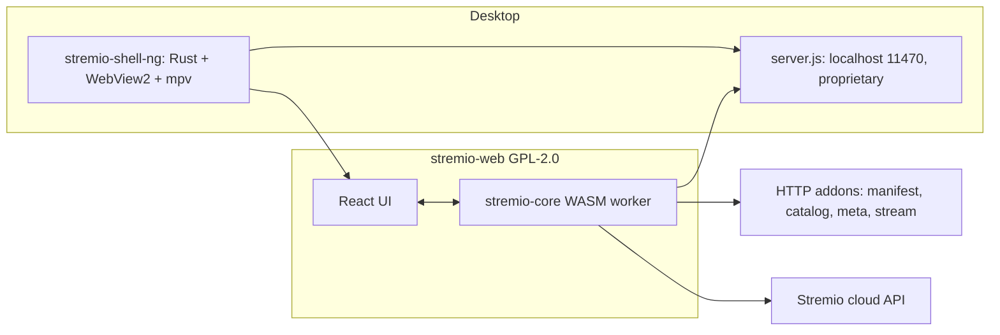
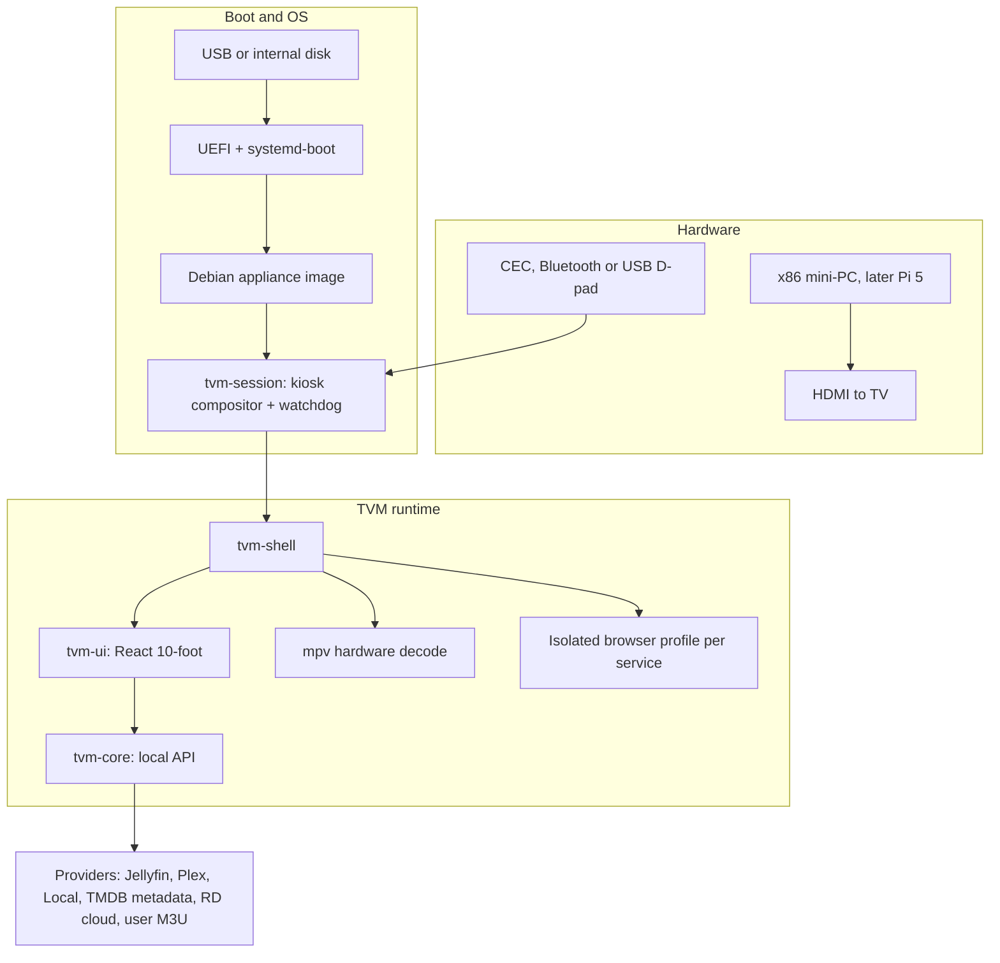

# TVM Architecture and Implementation Plan

This document is the specification for the implementing agent (Claude Opus 5 in Cursor). It is based on inspection of this repository, the previous Windows prototype, the real Stremio stack (not just [stremio-web](https://github.com/Stremio/stremio-web)), and the local Stremio installation on the development machine.

Phase 0 is this document. Implementation starts at Phase 1.

---

## A. Executive summary

TVM is a **TV-first media appliance**: a polished, remote-driven home screen that boots like a set-top box, plays the user's own and licensed media, and launches legitimate streaming services the user already pays for.

It is **not**:

- A website that merely looks like Stremio
- A USB flash drive that boots when plugged into a random TV's USB media port (that is not how TVs work)
- A rebuilt Stremio with Torrentio hard-wired in
- A "dodgy Fire Stick" whose movie catalog is torrent indexes plus Real-Debrid

**What we are actually building:** a small computer (mini-PC, NUC-class stick, or later Raspberry Pi) boots TVM from USB or internal storage, outputs HDMI to the TV, and is controlled with a D-pad remote. TVM's homepage is the OS shell: Continue Watching, library, search, apps (Netflix and similar as isolated official web apps), settings, and a first-run wizard.

**Hard product constraints (non-negotiable):**

- Do **not** implement Torrentio, torrent search, magnet scraping, or "if Real-Debrid doesn't have this title, find a torrent."
- Do **not** bake API tokens into source, committed env examples, or frontend bundles. No credential shared during planning may ever appear in this repository.
- Do **not** fork [stremio-web](https://github.com/Stremio/stremio-web) or [stremio-core](https://github.com/Stremio/stremio-core) into TVM. They are GPL-2.0; copying them would force TVM to GPL-2.0 and require shipping corresponding source. Learn the **layering**, write original code and original branding.
- Do **not** copy the previous prototype at `C:\Users\Gathe\Documents\Dodgy Fire Stick` (npm name `tv-torrent-streamer`, GitHub `GL-327/Fire-Stream-TVM`). Reuse **ideas** (spatial nav, on-screen keyboard, mpv, isolated service webview), not that codebase.

---

## B. Recommended architecture

### What already exists

| Location | Reality |
| --- | --- |
| This repository | Empty git scaffold. Remote `https://github.com/GL-327/TVM.git` has no commits or refs; local `main` is unborn. No application source. Treat as greenfield. |
| `C:\Users\Gathe\Documents\Dodgy Fire Stick` | Previous attempt: Electron + React + norigin spatial nav + mpv + Castlabs Widevine Electron + Torrentio + Real-Debrid + Windows kiosk. A leftover Rust `stream-server.exe` 0.1.2 still owns `AppData\...\stremio-server`. Do not import. |
| Official Stremio on the dev machine | 5.0.24 (`stremio-shell-ng.exe`) loads `https://web.stremio.com/` in WebView2. It spawns `stremio-runtime.exe` 18.12.1 running a proprietary `server.js` 4.21.0. Playback is `libmpv-2.dll` plus bundled ffmpeg 4.4.1. The streaming server is not open in the same way the UI is. |
| Local Stremio data | Addon configuration lives in the `web.stremio.com` WebView profile, not flat files under Programs. Official cache is `Roaming\stremio\stremio-server`. `Local\stremio-server` is leftover from the prototype. Do not modify these installations. |

### Stremio is four products, not one repo

Lessons to copy **as architecture**, not as code:

- **The UI does not own business logic.** A core owns catalogs, library, progress, and provider calls.
- **Playback is native mpv**, not an HTML5 `video` element, on the appliance. stremio-shell-ng does this because Qt/WebView composition kills hardware decode.
- **Providers are HTTP plugins** with a manifest and resource types. TVM will have its **own** provider contract (not the Stremio addon protocol), so we are neither a Stremio clone nor pulled into the torrent-addon ecosystem.
- **Shell, UI, core and player must stay separable** so a crash in playback does not permanently kill the home screen.
- **Do not copy Stremio's listen address.** The official `server.js` binds `0.0.0.0:11470` and `:12470`, which is LAN-visible. TVM core must bind `127.0.0.1` only.
- **Do not scrape Stremio addon URLs** from the local WebView profile (Torrentio is present there). TVM providers are independent and legal-only.

### TVM layering (target)

**Windows SKU (development plus the existing kitchen mini-PC):** skip the Linux boot layer. `tvm-shell` autostarts as a kiosk at login (the old "Fire Stick mode" idea, done properly). Same UI and core.

**Linux SKU (the USB appliance):** the USB **is the OS disk for the computer**, not for the TV.

---

## C. Technology stack

- **OS (appliance):** Debian 13-based image built with [mkosi](https://github.com/systemd/mkosi), systemd-boot, and A/B root via systemd-sysupdate later. USB/UEFI boot is real, updates and rollback are solvable, it is not snap-locked like Ubuntu Core, and not as heavy as Yocto for a solo project.
- **OS (development):** Windows 10/11, which is this machine and the previous kitchen-TV host.
- **Languages:** TypeScript for UI and core in v1, because it is the fastest path and the previous prototype already proved React + TypeScript on this machine. Optionally Rust later for `tvm-session`/watchdog only, if Node is too heavy on a Pi.
- **UI:** React 19 + Vite + TypeScript. Spatial navigation via `@noriginmedia/norigin-spatial-navigation` (already validated in the prototype). Routing is a **view stack** where Back pops, not a mouse-website router as the source of truth.
- **Design system:** original TVM tokens in `packages/design` (type, colour, motion, focus ring). No Stremio purple clone, no generic dashboard.
- **Shell:** Electron from Castlabs Widevine builds on Windows, for legitimate EME in official web apps. On the Linux appliance, prefer Chromium kiosk plus a native mpv overlay, or the same Castlabs Electron if Widevine web apps are required. Do not invent a browser.
- **Playback:** mpv with `gpu-next`, D3D11VA on Windows, VA-API or NVDEC on Linux, driven over JSON IPC from the shell. The UI is an overlay and video is a separate plane, for the same reason stremio-shell-ng does it.
- **Core:** local HTTP and WebSocket bound to `127.0.0.1` only (`apps/core`), with SQLite for library, progress and settings. It is testable without the UI, and the UI cannot hold secrets.
- **Networking:** undici/fetch in core, TLS verification on, never `NODE_TLS_REJECT_UNAUTHORIZED`.
- **Storage:** SQLite plus filesystem cache directories. Use electron-store only as a thin settings file if needed; prefer one SQLite database in the user-data partition.
- **Auth:** per provider. Jellyfin and Plex use official login. A Real-Debrid bearer token is entered in the wizard and stored in the OS credential store (DPAPI on Windows, libsecret or a 0600 file on Linux), never in the renderer.
- **Updates:** Windows uses electron-updater against GitHub Releases of the private repo (or a later update endpoint). Linux uses systemd-sysupdate signed images. App updates must not wipe `/var/lib/tvm`.
- **Testing:** Vitest for core, Playwright for keyboard-only spatial navigation, mpv IPC contract tests, and a QEMU boot smoke test for the USB image.
- **Package manager:** pnpm workspaces.
- **Not chosen:** Flutter (weaker DRM and service embedding on Linux), Lightning.js (TV-native but slower to build here), forking stremio-core (GPL), and Kodi/LibreELEC as the product (useful prior art, wrong branding).

---

## D. USB boot strategy

**Honest limitation:** plugging a flash drive into a Samsung, LG, Sony or TCL **TV USB port** will almost never boot a custom OS. Those ports exist to read photos and video files. A Fire Stick is a computer with an HDMI plug, not a flash drive.

**Supported boot path:**

1. Build `tvm-appliance.img` (GPT: ESP, root, persistent data).
2. Flash to USB with a documented Windows path (Rufus or balenaEtcher) and a Linux `dd` path.
3. Plug the USB into an x86_64 machine that can UEFI-boot: mini-PC, laptop, or Intel Compute Stick.
4. In the firmware boot menu, select USB first. Secure Boot is off for v1; a signed UKI comes later.
5. systemd-boot loads the Debian root (read-only squash/erofs later; ext4 is fine for the prototype).
6. `tvm-session.service` starts the kiosk compositor, then the shell, then the UI. No desktop, and no cursor unless a mouse is attached.
7. A persistence partition `tvm-data` holds settings, credentials and cache.

**Phase 1 proof:** a USB that boots to a full-screen TVM splash with one focusable button, on VirtualBox/QEMU and on one real mini-PC. Not the full app.

**Pi 5** is SKU 2 (ARM64 image), not v1.

---

## E. Hardware strategy

**Primary target (v1):** x86_64 mini-PC, 8 GB RAM, Intel N100/N150 or AMD equivalent, HDMI, UEFI, Ethernet or Wi-Fi. This matches the previous kitchen-TV PC.

**GPU and decode:** Intel Quick Sync or AMD VA-API, NVIDIA NVDEC if present. mpv must use hardware decode, and must fail visibly rather than silently falling back to software at 4K.

**HDMI:** the TV is a dumb display and speaker set. Audio goes over HDMI through ALSA/PipeWire.

**Remote, in order of reliability:**

1. A USB or Bluetooth HID remote that sends arrow keys, Enter, Escape and media keys
2. HDMI-CEC via `cec-ctl`/`libcec`, when the mini-PC's HDMI actually tunnels CEC (many cheap boxes do not)
3. A keyboard during development

Assume CEC is best-effort. The UI must be 100% usable with a D-pad or keyboard.

**TV compatibility:** any HDMI display. No dependence on Tizen, webOS or Android TV USB boot.

---

## F. UI architecture

### Design bar

Ten-foot, commercial, not a developer demo: 28-40px body text, 48-72px titles, an 8-12px grid, a 4-6px inset focus ring plus 1.06-1.08 scale, 200-280ms motion, artwork first, no hover-only affordances, no tiny icon rows.

Visual direction: dark cinema with a warm highlight, not Netflix red and not Stremio purple. One typeface pair. One card language across Home, Details and Settings.

### Screen map

- **Setup wizard** (first boot only)
- **Home:** hero, Continue Watching, Watchlist, library rows, apps row, trending-from-library
- **Apps:** official service tiles
- **Library:** movies and series from providers
- **Details:** metadata, seasons and episodes, Play only when a legal stream exists
- **Search:** on-screen keyboard, suggestions, recent searches
- **Player overlay:** play/pause, seek, subtitles, audio, back
- **Settings:** grouped and remote-friendly
- **Profiles** (later): local profiles, not a Stremio cloud account
- **Error, offline and recovery** full screens, always focusable

### Navigation model

- A single **view stack**. Back pops. Home wipes to Home. The player is a stack entry, and exiting the player also drops the transient preview beneath it.
- The focus engine is a core module, not an afterthought. Every screen registers a focus graph.
- Set default focus on mount, and restore focus on back.
- Modals trap focus, and Back closes the modal before popping the page.

### Component hierarchy

`AppShell` wraps `FocusRoot`, which contains `TopBar` and `ViewStack`. Screens are composed from `Hero`, `Rail`, `PosterCard`, `AppTile`, `OSK`, `Dialog`, `SettingsList` and `PlayerOverlay`.

---

## G. Media architecture

The UI talks only to **tvm-core**. Core talks to **providers**. There are no provider imports in React screens.

Provider interface (conceptual):

- `manifest()` — id, name, capabilities (`catalog`, `meta`, `children`, `playback`, `search`, `progress`)
- `catalogs()`, `browse()`, `search()`, `metadata()`, `children()`
- `resolvePlayback(id)` returns an HTTPS URL with headers and optional subtitles, or a typed `Unavailable` result (not in library, or not configured)
- `progress` get and set

**Allowed v1 providers:**

- **Local, USB or NAS folders** chosen by the user
- **Jellyfin** via its official API
- **Plex** via its official API
- **TMDB** as metadata only, using the user's own TMDB API key, never as a stream source
- **Real-Debrid cloud** limited to the user's existing RD files and unrestricting hoster links the user supplies, never as a movie search engine
- **User-supplied M3U** for IPTV the user already subscribes to, with no bundled playlists

**Playback path:** core returns a direct HTTP(S) URL, the shell starts mpv, and the overlay binds to mpv IPC. Watch progress flows from mpv `time-pos` into core SQLite every 10 seconds and on pause or stop.

**Caching:** metadata in SQLite, artwork in an LRU disk cache, and no unbounded torrent caches.

**Search:** fan out to configured providers and merge results by provider namespace (`jellyfin:…`, `local:…`). TMDB hits with no playback source show "Not in your libraries" instead of a fake Play button.

---

## H. Service integrations

The Home **Apps** row launches isolated browser sessions (the previous `ServiceBrowser` idea): a persistent partition, sandbox on, no node integration, and Back or Escape returns to TVM.

Rules:

- Use official sites and apps with the user's real login.
- Do not spoof device identity or Widevine L1, patch service apps, or ship extracted CDMs.
- Expect Widevine L3 and roughly 720p in a custom Linux or Electron shell. Document this. HD and 4K stay on the TV's own official app or a certified dongle.
- If a service blocks the embedded browser, show a TV-friendly error rather than "fixing" it with user-agent or DRM hacks.
- Extensibility: a `services.json` list of `{ id, name, url, icon }`. Netflix, Prime Video, Disney+, YouTube and BBC iPlayer are defaults that open official URLs, not scrapers.

No Android TV or Waydroid in v1: Widevine L1 is unavailable on a generic image and the complexity explodes.

---

## I. Security

- Secrets live only in core, via the OS credential store. The renderer sees `{ configured: true, username }` and never the token.
- `.env` is gitignored, and `.env.example` contains empty keys only.
- There is no `REALDEBRID_DEFAULT_KEY` module. The old prototype compiled a token into the binary; that pattern is banned.
- HTTPS only to providers, with certificate validation on.
- Core binds `127.0.0.1`, never `0.0.0.0`.
- Logs redact `Authorization` headers, tokens and cookies.
- Updates use signed artifacts, and unsigned artifacts are refused.
- Any Real-Debrid token shared during planning must be treated as compromised and rotated at [real-debrid.com/apitoken](https://real-debrid.com/apitoken).

---

## J. Storage

| Data | Location | Survives update |
| --- | --- | --- |
| Settings, profiles, wizard flag | `tvm-data/state.sqlite` | yes |
| Credentials | OS keychain, or `tvm-data/secrets` at 0600 | yes |
| Watch progress | SQLite | yes |
| Artwork and metadata cache | `tvm-data/cache/` | disposable |
| Logs | `tvm-data/logs/`, rotated | yes |
| App and OS | separate partition | replaced on update |

On Windows these map to `%PROGRAMDATA%\TVM\` and `%APPDATA%\TVM\`.

---

## K. Updates and recovery

- A watchdog restarts the shell if it exits. Three crashes in 60 seconds drops to a recovery UI: safe mode with settings and shutdown, no providers.
- Linux uses A/B root, and a failed boot count returns to the previous slot via systemd-boot assessment.
- A recovery USB can mount `tvm-data` and reset the app without wiping credentials unless the user confirms.
- With the network down, show a cached home plus an offline message that is still navigable.
- Shutdown and reboot from Settings go through PolicyKit-limited commands, not a root shell.

---

## L. Testing

- **Unit:** provider merge, progress, settings schema, secret redaction, focus graph reducers
- **Integration:** UI to core over HTTP, a Jellyfin fixture, a local-folder fixture, and a fake mpv IPC
- **UI:** Playwright driven by keyboard only, covering Home rails, Back, the on-screen keyboard, modal traps and Settings
- **Playback:** legal sample files (Big Buck Bunny) for seek, subtitles, pause and HDMI audio
- **Hardware:** one real TV, a mini-PC, USB boot, and a cheap HID remote
- **Failure:** airplane mode, core crash, full disk, killed mpv, and an invalid user-entered Real-Debrid token

---

## M. Development phases

Do these in order. Do not skip ahead to Torrentio-shaped catalogs, and do not "just quickly" add a magnet resolver.

### Phase 0 — Plan in repo

- **Objective:** freeze the architecture in git
- **Files:** `docs/TVM_IMPLEMENTATION_PLAN.md`, `.gitignore`
- **Done:** the plan is committed, with no app code and no secrets

### Phase 1 — Repo skeleton and bootable hello

- **Objective:** a monorepo plus a USB or VM that boots to a TVM splash
- **Layout:** `apps/ui`, `apps/shell`, `apps/core`, `packages/design`, `packages/nav`, `os/`
- **Tasks:** pnpm workspace, Vite UI hello, Electron kiosk on Windows, an `os/` Debian mkosi build or a documented live-USB kiosk that opens the UI, and a QEMU smoke test
- **Tests:** a `pnpm test` placeholder plus a QEMU boot checklist
- **Done:** `pnpm dev` shows a focusable splash on Windows, and the USB or VM shows the same splash with no desktop

### Phase 2 — Shell and remote navigation

- **Objective:** the D-pad works everywhere in a dummy shell
- **Tasks:** `FocusRoot`, view stack, Back and Home, recovery screen, watchdog
- **Tests:** a Playwright keyboard suite over dummy screens
- **Done:** focus can never be lost, and Back never dead-ends

### Phase 3 — Design system

- **Objective:** look like a product
- **Tasks:** tokens, `PosterCard`, `Rail`, `Hero`, `Dialog`, `SettingsList`, motion, at 1920x1080 and 3840x2160
- **Done:** visual QA against a short screenshot checklist covering focus ring, type scale, and empty, error and loading states

### Phase 4 — Homepage

- **Objective:** Home is the product
- **Tasks:** hero, rails, apps row, profile chip, search entry, skeleton loaders
- **Done:** a remote-only walkthrough of Home feels like a TV OS

### Phase 5 — Media core and legal providers

- **Objective:** catalogs from Jellyfin, Plex and local folders, with TMDB metadata
- **Tasks:** provider interface, SQLite, a local folder provider plus one server provider, details page, and the "not in library" state
- **Done:** a file on disk plays through core, and there is no torrent or Torrentio code in the tree (searching for `torrentio` returns nothing)

### Phase 6 — Playback

- **Objective:** mpv plane plus overlay
- **Tasks:** IPC, seek, pause, subtitles, audio tracks, progress, HDMI audio, network retry
- **Done:** a legal sample and a library file both play full-screen under remote control

### Phase 7 — Accounts, apps and Real-Debrid (legal subset)

- **Objective:** service tiles, plus user-entered Real-Debrid for cloud files and unrestricting user-supplied links
- **Tasks:** isolated webview, a wizard field for the RD token, and only the `/user`, `/downloads` and `/unrestrict/link` endpoints
- **Forbidden:** Torrentio, `/torrents/addMagnet` driven by title search, and Cinemeta used as catalog-plus-streams
- **Done:** the Netflix tile opens the official site, and the RD token never reaches the UI bundle

### Phase 8 — Setup and settings

- **Objective:** a first-boot wizard plus the settings information architecture: Network, Display, Audio, Input, Accounts, Services, Playback, Subtitles, Appearance, Language, Accessibility, Privacy, Updates, Storage, Diagnostics, Restart and Shutdown
- **Done:** the wizard is completable with a D-pad, and advanced settings stay collapsed

### Phase 9 — Updates and recovery

- **Objective:** appliance survival
- **Tasks:** watchdog, safe mode, Windows auto-updater, and a Linux image update design even if v1 ships as "replace the USB"
- **Done:** killing the shell brings it back, and a corrupt update lands on the previous slot or recovery

### Phase 10 — Hardware

- **Objective:** a real TV
- **Tasks:** USB boot, remote, a CEC attempt, 4K decode, overscan, Wi-Fi wizard
- **Done:** a written hardware matrix

### Phase 11 — Polish

Boot time, image cache, animation budget, accessibility (high contrast, large text), copy, and empty states.

**TVM DNA** (the taste profile from the old app) is Phase 11 or later, and only over library titles.

---

## N. Technical risks

- **USB into a TV:** impossible on typical TVs. Mitigation: document the mini-PC plus USB story honestly.
- **CEC:** flaky and TV-specific. Mitigation: HID remote first.
- **DRM and Netflix HD:** L3 is likely. Mitigation: do not promise 4K inside TVM; the tiles are a hub.
- **GPL:** forking Stremio would infect TVM. Mitigation: original code.
- **Castlabs Electron licensing** for Widevine redistribution: verify before shipping binaries.
- **mkosi on Windows:** image builds may need WSL2 or a Linux CI runner. Plan on WSL2.
- **Previous prototype coupling:** the temptation to copy `TorrentioProvider`. Forbidden.
- **Real-Debrid terms and copyright:** using RD as a global movie CDN fed by torrent indexes is the piracy stack, and is out of scope. RD stays a user-owned cloud and unrestrict client.
- **IPTV:** user-supplied M3U only, with no bundled sports playlists.

---

## O. Implementation instructions for the coding agent

1. **First commit after this plan:** scaffolding only (Phase 1). Re-read this file every session.
2. **Do not touch** the Stremio install directories, `Dodgy Fire Stick`, or `Fire-Stream-TVM`, except as read-only reference.
3. **Do not add** Torrentio, magnet search, libtorrent, copies of `server.js`, or Stremio addon installs.
4. **Do not commit secrets.** If a token appears in chat or in a file: stop, scrub it, rotate it, and gitignore the path.
5. **Commits** are small and conventional (`feat(ui): …`, `feat(core): …`, `feat(os): …`). Never `--no-verify`, and never force-push `main`.
6. **Structure:** providers live behind `apps/core`, and the UI consumes only API types from `packages/types`.
7. **UI rule:** if a control cannot be operated with arrows, OK and Back, it is not done.
8. **Playback rule:** mpv for TVM media, and a webview only for official services.
9. **Stop and ask** when the hardware SKU changes, a provider needs OAuth that cannot be tested, Widevine licensing blocks shipping, or a request would add torrent or index scraping.
10. **A good increment** is one phase slice with tests, screenshots of focus states, and no secrets.

After Phase 0 is committed, start Phase 1. Do not implement the full homepage in the first session.
