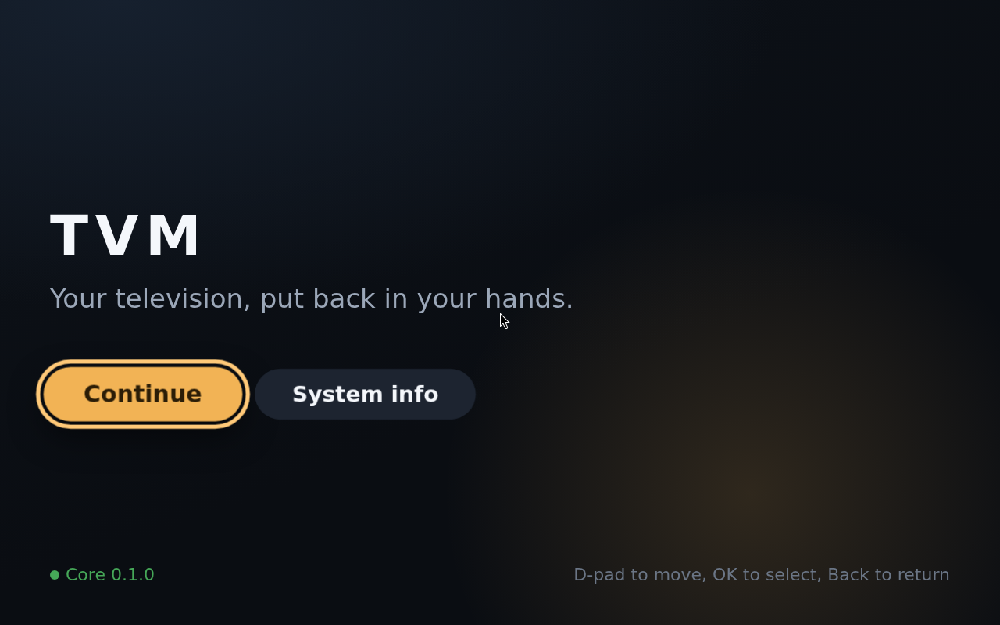
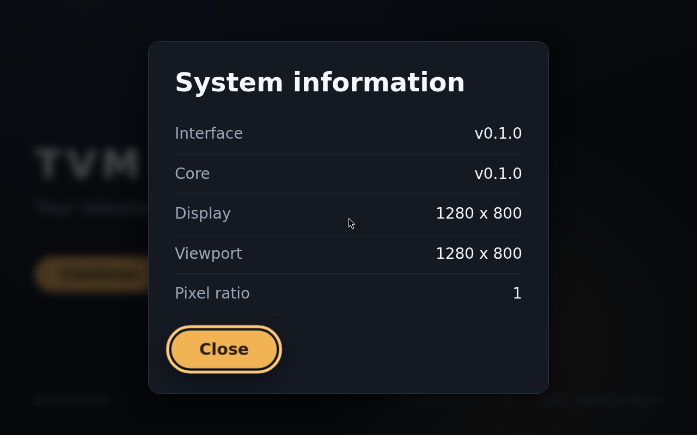

# Boot checklist

Phase 1 is finished when every box below is ticked in QEMU and on one real
mini-PC. Run it after any change to `os/`.

An appliance is judged on the boot, so treat a cosmetic failure here (a visible
console, a mouse pointer, a white flash) as a real failure.

## A. Image build

- [ ] `./scripts/stage-app.sh` completes and `staging/usr/lib/tvm/{core,ui}` exist
- [ ] `mkosi --force` completes without errors
- [ ] `output/tvm-appliance.raw` exists and is larger than 1 GB
- [ ] The checksum file is written next to the image

## B. QEMU boot

Run `./scripts/qemu-smoke.sh`.

- [ ] The firmware hands over to systemd-boot without a menu timeout
- [ ] No kernel log scrolls past; the screen stays dark until TVM paints
- [ ] The TVM splash appears within 30 seconds of power-on
- [ ] No mouse cursor is visible, unless a pointer device is genuinely
      attached. QEMU attaches one by default, so this box only means something
      on hardware
- [ ] No terminal, login prompt or desktop is reachable
- [ ] The core status in the footer reads green, not "Core unavailable"
- [ ] Arrow keys move focus between Continue and System info
- [ ] Enter opens System information; Escape closes it
- [ ] System information reports the expected display resolution
- [ ] `systemctl status tvm-core tvm-session` both show active (from a serial console or SSH)

## C. Recovery behaviour

- [ ] `systemctl kill tvm-session` and the kiosk comes back within 5 seconds
- [ ] `systemctl stop tvm-core` and the interface reports core unavailable rather than a browser error
- [ ] Starting core again restores the green status without a restart
- [ ] Power-cycling mid-boot still reaches the splash

## D. Real hardware

Target: x86_64 mini-PC, 8 GB RAM, UEFI, HDMI to a television.

- [ ] The stick appears in the firmware boot menu
- [ ] It boots with Secure Boot disabled
- [ ] The television reports a sane resolution and refresh rate
- [ ] The picture is not overscanned; the safe-area padding is not cut off
- [ ] Text is readable from roughly three metres
- [ ] A USB or Bluetooth HID remote moves focus and selects
- [ ] The focus ring is obvious from the sofa
- [ ] Cold boot to splash is recorded, in seconds
- [ ] `/var/lib/tvm` survives a reboot

## E. What is explicitly not tested yet

These belong to later phases and must not block Phase 1.

- Playback, mpv and hardware decode (Phase 6)
- HDMI-CEC (Phase 10, and best-effort at that)
- Wi-Fi setup (Phase 10)
- A/B updates and rollback (Phase 9)
- Secure Boot with signed UKIs

## Record the result

Note the machine, firmware version, television model, boot time and anything
that misbehaved. The hardware matrix in Phase 10 is built from these notes.

### 2026-08-15, QEMU, first run

Sections A and B passed, driven headlessly: QEMU with OVMF and KVM under WSL2,
screenshots taken through the monitor's `screendump`, keys sent with `sendkey`.

- Boot reaches the splash with no console output and no login prompt
- Core reports healthy, so the session waited correctly before painting
- Right, OK, Back and Left all behave, and Back restores previous focus
- Reported display 1280x800, which is the virtio-vga default rather than a bug

What a correct boot looks like, and the panel reached with OK:

Not covered: section C recovery behaviour, and all of section D.

Four defects found and fixed during this run, kept here because each one
produced a confusing failure rather than a clear error:

1. No kernel in the package list. mkosi built the entire image and only then
   said "a bootable image was requested but no kernel was found".
2. `systemd-firstboot` held the boot open on tty1 asking the television to
   configure itself. Now preset in `mkosi.conf` and masked in `mkosi.postinst`.
3. `Output=tvm-appliance.raw` produced `tvm-appliance.raw.raw`, because mkosi
   appends the format suffix itself.
4. No DRI drivers, so nothing could render in a VM without a GPU.
